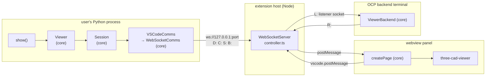
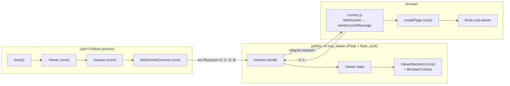
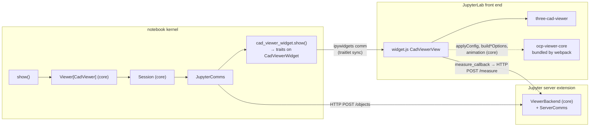

# Design

`ocp-viewer-core` is the shared half of the OCP viewer ecosystem: one show pipeline, one set of configuration semantics, one camera policy, one page. Four viewers use it, and each supplies only what is genuinely its own — a transport, and a description of what its surface can be told.

It is one project published to two registries under one version: `ocp-viewer-core` on PyPI for the Python half, `ocp-viewer-core` on npm for the JavaScript half. The two are shipped and versioned together, so which version of the pair a host has is one question rather than two.

The four hosts, and where each stands:

| host | package | adopted |
| --- | --- | --- |
| OCP CAD Viewer for VS Code | `ocp_vscode` + the extension | yes, on branch `viewer-core` |
| the standalone viewer | `ocp_viewer` | yes, it was written against the core |
| Jupyter CadQuery | `jupyter_cadquery` + `cad_viewer_widget` | yes, on branch `viewer-core` in both |
| build123d Studio | — | not yet |

## The one rule everything follows

**The sender translates to the receiver's paradigm.** Python speaks snake_case and enums; JavaScript speaks camelCase and plain JSON. The conversion happens once, at the wire, on the way out — and nowhere else. Nothing on the JavaScript side renames a key, unwraps an enum, or accepts a key in two spellings, because a host that has not converted should surface as an unknown key rather than be quietly tolerated.

The second rule follows from the first: **no host is nameable inside this package.** No `port=`/`viewer=` pairs, no `is_jupyter_cadquery`, no environment sniffing, no host name in a string. Where the core needs to know something host-specific, it asks the host's objects rather than branching on which host it is.

---

# The Python half

## Four objects, and a module of names

```
Comms   ── the transport. The only class a host must write.
Session ── one show's conversation: the cached reads, and the call's keywords.
Config  ── the defaults, the precedence over them, and the enums.
Viewer  ── the show family, as methods.

keys.py ── the config key vocabulary, in both languages.
```

A host wires them together once, at import:

```python
comms   = MyComms()                                    # the only class the host writes
session = Session(comms)
config  = Config(session, WORKSPACE_CONFIG_KEYS, EXCLUDE_KEYS)
viewer  = Viewer[MyHandle](config)

show, show_object, show_all = viewer.show, viewer.show_object, viewer.show_all
set_defaults, get_defaults, reset_defaults = config.set_defaults, config.get_defaults, config.reset_defaults
```

**Bound methods, never `partial` and never `@wraps`.** Measured with basedpyright before the shape was chosen: a bound method hovers with the full signature, `self` gone and `config` invisible; `functools.partial` hovers as `partial[str]` with no parameters at all; `@wraps` keeps the parameters but leaks `config` into the visible ones. `show` carries 90 keyword parameters, `show_object` 91 and `show_objects` 84 — that completion is the whole reason the show family lives on a class rather than being module functions taking a config. `show_all` has a second reason: it reads its caller's frame through `inspect.currentframe().f_back` to find the variables to draw, and wrapped, that frame would be the wrapper's.

### `Comms` — the transport

`ocp_viewer_core/comms.py`. Five ways to send, one to listen, one to test a handle, one hook to encode, and a pair that carries the call's keywords.

| method | what it must do | default |
| --- | --- | --- |
| `send_data(data, timeit)` | send a model, return this host's handle for it | raises |
| `send_config(config, timeit)` | send a config block to the viewer | raises |
| `send_command(data, timeit)` | send a command and return the viewer's answer | raises |
| `send_backend(data, timeit)` | send to the measurement backend | raises |
| `send_response(data, timeit)` | answer a request from the viewer | raises |
| `encode_config(config)` | put a config block into the names this host's viewer reads | `keys.to_javascript` |
| `listen(callback)` | take messages from the viewer until it stops | raises |
| `is_handle(obj)` | whether `obj` is this host's viewer handle | `False` |
| `begin(keywords)` / `end()` | the keywords of the call in flight | store / clear |

The five senders **raise `NotImplementedError` rather than having a docstring for a body**, and that is deliberate twice over. A body of only a docstring types as returning `None`, which contradicts `send_data`'s promise of a handle and spreads — `Session.workspace_config()` would be typed `None`, and `get_defaults()` would end up calling `dict(None)`. It is also the right runtime behaviour: a host that omits one should fail rather than silently send nothing.

The last four have working defaults, because not every host needs them. Jupyter CadQuery answers in-process and never listens; a host with no handle need not test for one.

**`H` is the handle type.** `Comms` and `Viewer` are generic in it, so one `show` definition gives Jupyter CadQuery's users `CadWidget | None` and ocp_vscode's users plain `None`, each with correct completion on the result.

**`is_handle` replaces a host name in a string.** `show_all` walks the user's namespace, and in a notebook that namespace contains the widget itself, which must not be drawn into itself. ocp_vscode tested this by looking for a module name inside `str(obj.__class__)` — a host named in a string, which cannot move into shared code. Asking the transport puts the question to the one object that can answer it without naming anybody.

**`encode_config` is a hook, not a fixed rule.** The default renames to the renderer's camelCase, because for three of the four hosts the receiver is three-cad-viewer over a wire. Jupyter CadQuery overrides it with the identity: an ipywidgets traitlet is one name in both languages, so what Python sends is what the JavaScript half reads. The rule is unchanged — the sender translates to the receiver's paradigm — and here the two paradigms are one. That override is the discovery that made the hook exist; the first two hosts had agreed by accident.

### `Session` — one show's conversation

`Session` caches the two reads a show makes, `status()` and `workspace_config()`, and scopes both those answers and the call's keywords to a single call.

**The cache exists because a show used to open the same connection six times.** `combined_config` asks for both, `_tessellate` asks again, `get_changed_config` asks again. Caching them turns that into two.

**The cache must not outlive one show, and `_splash` is the case that proves it.** `_splash` is the handshake that stops `reset_camera=KEEP` inheriting the splash logo's camera: it is `True` while the logo is on screen and `False` from the first real model on. An answer held across shows would keep forcing a camera reset and quietly discard every explicit `reset_camera=`. So `Session.clear()` is called from `Viewer._show` in a `finally`, and `_show` is the single choke point every model send routes through — `show` calls it directly, and `_show_object` and `show_objects` reach it through `show`.

**`Session.send_data` is where the config block is translated**, by calling `comms.encode_config`. On `Session` rather than on `Comms` because `Comms` is what a host overrides, and a base-class conversion would be skipped by every implementation that forgot to call `super()`. Only the `config` block is renamed; the mesh beside it is geometry with its own keys, and walking it would be both wrong and expensive.

### The per-call keyword scope

`Comms.begin(keywords)` / `Comms.end()`, opened and closed by `Session` around every call.

**The show signature is the superset of every host's parameters, and each host acts on its own and ignores the rest.** `port` addresses one of several viewers in VS Code; `viewer`, `anchor`, `cad_width`, `height` and `pinning` name and size a notebook sidecar. All of them are in the one signature, and each host reads the ones it owns out of `self.keywords` inside its own send methods.

**It has to be a scope, not an argument, because the reads come first.** `_tessellate` asks for `status` and `workspace_config` before any model is sent, so a `port` carried only in the model's config block would reach the transport two round trips late — and

```python
show(obj, port=3939)
show(obj, port=3940)
```

would read the second model's camera and tree state from the first viewer. It cannot be a constructor argument either: binding `show = viewer.show` fixes one `Comms` per `Viewer` for its whole life.

The keywords and the cached answers have exactly one lifetime between them, which is one call — so `Session.clear()` ends both.

`Config.validate_keyword` is the other half of the same rule: `begin` **delivers** a keyword a host can act on, and `validate_keyword` **refuses** one it cannot, with a reason rather than a boolean, so the warning can say why. `exclude_keys` is its default implementation.

### `Config` — defaults, precedence, enums

`ocp_viewer_core/config.py`. A host supplies two lists at construction:

- **`workspace_config_keys`** — the keys of the viewer's own reported state that survive into the next show. It has to name every key the user can change from the toolbar, not merely the keys the host stores in settings; a shorter list lets a second `show()` reset the user's toolbar to the workspace defaults.
- **`exclude_keys`** — the keywords this host may not be told, because its surface decides them.

**`exclude_keys` runs in opposite directions between hosts, which is the clearest argument for it being per host at all.** ocp_vscode and ocp_viewer exclude `cad_width` and `height` — a panel and a browser window decide their own geometry — and exclude `viewer`, `anchor` and `pinning`, which name a sidecar they do not have. Jupyter CadQuery excludes none of those, because a cell asks for a widget of a given size; it excludes `port` instead, since a sidecar is named, not dialled.

The precedence, in `combined_config`:

```
workspace config          (what the host stores)
  ← overlaid by the viewer's reported status, filtered to workspace_config_keys, but only when _splash is False
  ← overlaid by the defaults set in code   (Config.defaults)
```

**The defaults are applied last, and that asymmetry is load-bearing.** A key present in `Config.defaults` masks whatever the viewer reports for it. Which is why `collapse` is in `NOT_RESTORED_ON_RESET`: it is the viewer's own — the user changes it by clicking, and it comes back in `status` — so putting it back on reset would make `combined_config` answer `Collapse.ROOT` however the tree actually stands, and the next show would re-collapse a tree the user had just opened.

`DEFAULT_DEFAULTS` is module level and copied per instance, so construction and `reset_defaults()` read one source rather than two literals that drift.

The enums live here too — `Camera`, `Collapse`, `Render`, `AnalysisTool`, `UiTab` and the five `Studio*` families. **Their values are already what the receiver expects**: `Collapse`'s numbers are three-cad-viewer's `CollapseState`, `Camera`'s and `UiTab`'s are the strings it takes. So unwrapping the enum is the whole of the translation, and `set_viewer_config` unwraps *every* argument that is an `Enum` rather than consulting a list of names — the list was six long and `reset_camera` was not on it, so `set_viewer_config(reset_camera=Camera.KEEP)` used to put an enum object on the wire.

### `keys.py` — the vocabulary

A module of its own because both `config` and `comms` need it and neither may import the other. It maps `{python_name: javascript_name}` in groups — `UI_TOOLBAR`, `UI_TREE`, `UI_CLIP`, `UI_ZEBRA`, `UI_STUDIO`, `UI_MATERIAL`, `DISPLAY`, `MOUSE`, `GRID`, `RENDERER`, `CONTROL`, `CAMERA` — merged into `ALL` and `SETTABLE`.

**`merge` refuses a redefinition.** A key belonging to more than one group is ordinary (`UI_MATERIAL` is both a ui group and a renderer group) and is fine as long as every group names the same renderer option. Two groups disagreeing is a bug, and concatenating tuples takes the last one silently — which hides the disagreement instead of reporting it. It also killed four duplicate keys the `+` had created.

**A `None` on the right-hand side means the key never reaches the renderer as an option** — either it is ours alone (tessellation, Python-side control) or it is applied by calling a method rather than by passing an option: `explode` is `setExplode`, `states` is `setStates`, `reset_camera` is `setView`.

**The renderer names are written down, not derived.** A mechanical snake-to-camel transform is right for most of them and silently wrong for the rest — `clip_planes` is `clipPlaneHelpers`, `default_edgecolor` is `edgeColor`, `studio_ao_intensity` is `studioAOIntensity`, `modifier_keys` is `keymap`, `orbit_control` is `control` — and three-cad-viewer drops an option it does not recognise with no diagnostic at all. `to_javascript` uses the table where there is one and the mechanical spelling where there is not.

**Leading-underscore keys pass through untouched.** They are protocol, not configuration: `_splash` is a handshake, and the browser reads it under exactly that name. They also break the transform — `"_splash".split("_")` starts with an empty segment, so the mechanical spelling is `Splash` and the flag silently never arrives.

### `Viewer` — the show family

`ocp_viewer_core/show.py`, the largest module. The whole show family as methods: `show`, `show_object`, `show_objects`, `show_all`, `show_clear`, `push_object`, `remove_object`, `reset_show`, `save_screenshot`, plus `_tessellate`, `_convert`, `_show` and `_show_impl`.

**Everything the old module-level functions reached for through globals is instance state**: the incremental object stack, the last bounding box, the last tessellated paths, the colormap and the last-call marker. Two `Viewer`s in one process — two notebook sidecars, or a kernel and a debuggee — no longer overwrite each other's. That defect is what the class exists to close.

The pipeline of one show:

```
show(*objs, **kwargs)
  └─ _show                       begin the keyword scope; clear the session in a finally
      └─ _show_impl
          ├─ align names / colors / alphas / modes / materials, resolve the colormap
          └─ _convert
              ├─ _tessellate     → instances, shapes, config, count, mapping
              │     ├─ Config.combined_config()   ← status() + workspace_config(), both cached
              │     └─ ocp_tessellate: to_ocpgroup, tessellate_group
              └─ numpy_to_buffer_json → {"type": "data", "data": …, "config": …, "count": …}
          ├─ Session.send_data(t)         → Comms.encode_config(config) → Comms.send_data → handle
          └─ Comms.send_backend({"model": mapping})
```

`send_data` returning the host's handle is what lets that last step be one line for every host: one addresses its measurement backend by the widget it was just handed and another by a port, and both keep what they need inside their own `Comms`, where knowing about widgets or ports is legitimate.

Warnings are deliberately module-level rather than instance state: `warnings` is a process-wide registry and "warn once per session" means once per process, so two `Viewer`s warning twice about the same thing would be a regression, not isolation. The contrast with the show state above is the point.

### The modules beside the pipeline

| module | what it is | reaches OCP |
| --- | --- | --- |
| `comms.py` | the transport contract, `Session`, `MessageType` | no |
| `config.py` | defaults, precedence, enums | no |
| `keys.py` | the key vocabulary | no |
| `state.py` | the registry of running viewers, `~/.ocpvscode` | no |
| `websocket.py` | the websocket client every socket host uses | no |
| `show.py` | the show pipeline | yes |
| `backend.py` | the measurement backend | yes |
| `measure.py` | the OCCT measurements themselves | yes |
| `colors.py` | the colour catalogue and `BaseColorMap` | no |
| `logo.py` | the splash as measurable BREP | no |

**`__init__.py` imports nothing but the version.** A host imports the submodule it needs, so importing the package never loads the tessellator or OCP. That is also a detectable property rather than a promise: if the config merge or the transport contract could not import without geometry, the layer would have leaked and the import graph would say so.

**No OCP provider is declared.** The same `OCP` namespace is shipped by `cadquery_ocp`, `cadquery_ocp_novtk` and conda's `OCP`; naming one would break users of the other two. The leaf chooses. In practice OCP is always there — a viewer makes no sense without cadquery or build123d, and both pull a provider — so this is about the import graph, not about a bare install.

**`websocket.py` is one implementation of `Comms`, not the contract.** ocp_vscode and ocp_viewer both talk to a viewer over the same protocol and both use it; build123d Studio sends length-prefixed binary frames over a local socket and will implement `Comms` directly. The port is instance state rather than a module global, so two clients in one process address two viewers, and discovery is lazy: reading the state file, probing what it finds and possibly asking the user which viewer they meant should not happen because somebody imported a module.

**`backend.py` takes a transport rather than a port.** `ViewerBackend(comms)` — which viewer it answers, and how, is the host's business. The `jcv_id` parameter Jupyter CadQuery used to thread through it disappeared: it named the widget a response belonged to, which an injected `Comms` holds without anybody being told about widgets. It loads the logo at start, so the splash is measurable before any model has been sent.

**`state.py` keeps a host's name for a good reason.** `~/.ocpvscode` is written by the VS Code extension in TypeScript and read by every Python client to find a viewer; renaming it would strand every installation that already has one. What moved into the core is the fact that it is not one host's — a standalone registers in it too, and a client discovers any viewer through it.

---

# The JavaScript half

`js/src/`, published to npm, `three-cad-viewer` as a peer dependency with a major.minor floor. Plain ES modules, no build step of its own — each host consumes the source and bundles or serves it its own way.

| module | export | touches the DOM |
| --- | --- | --- |
| `page.js` | `createPage` | **yes — it is the page** |
| `render.js` | `createRenderer` | no |
| `apply.js` | `applyConfig`, `isApplicable`, `GEOMETRY_KEYS`, `VIEWS` | no |
| `options.js` | `buildDisplayOptions`, `buildRenderOptions`, `buildViewerOptions`, `preset`, the three default sets | no |
| `states.js` | `collectStates`, `currentStates`, `restoreStates`, `statesToRestore` | no |
| `notify.js` | `createNotifier`, `EVENT_KEYS` | no |
| `animation.js` | `addAnimationTrack`, `animate`, `animationDuration` | no |
| `logo.js` | `logo` | no |

Everything but `page.js` takes a three-cad-viewer instance and plain data, and can be tested headless against a stub viewer. That distinction is worth keeping: new DOM work belongs in `page.js` or in a host, not spread through the others.

**Names here are camelCase and values are plain JSON.** Nothing translates a name or unwraps an enum; Python did that once, at the boundary.

## `createPage` — the whole viewer page

A host that shows a page in a browser-like surface calls `createPage` and supplies four things it alone knows:

```js
const page = createPage({
  Viewer, Display, Timer,   // three-cad-viewer's three — only the host knows where it loaded them from
  send,                     // (command, message) => void — the host's channel to Python
  overrides,                // { display, viewer } — only what this host genuinely differs on
  theme                     // the host's resolved theme
});
// → { showSplash(config), setTheme(next) }
```

The page then owns: creating the `Display` and the `Viewer`, reusing the viewer across shows (`clear()` keeps the WebGL context, the viewer state and the studio environment cache alive), measuring the window and subtracting the chrome, the resize handler, the notifier, the renderer, and a `message` listener that handles every message type a host can deliver — `data`, `logo`, `ui`, `animation`, `screenshot`, `clear`, `show`, `set_relative_time`, `backend_response`.

Both page hosts deliver messages as a `message` event: the extension posts into the webview, and the standalone's socket shim posts what came off the wire. That is why one listener serves both.

**`ui` is refused while the splash is up** (`if (_config["_splash"]) return`), which is the browser-side half of the same handshake `_splash` performs in Python.

## `createRenderer` — drawing, and where the camera ends up

The part that was hardest to get right, and the part every client must agree on. Three modes, and the names understate the difference:

- **`keep`** — the camera *direction* survives; the distance is recomputed from the new bounding box, and the zoom is corrected by how much that distance moved. Not "leave the camera alone": a model ten times larger, left alone, is off screen.
- **`center`** — the direction survives and the target moves to the new centre.
- **`reset`, and the preset views** — the stored state is discarded. `reset` is `setView("iso")` plus a resize.

After rendering it **reads back** what the renderer settled on — position, quaternion, target, zoom, the clip and zebra state — because a render is a change three-cad-viewer does not notify about, and without the read-back the next `keep` would carry over the camera from two models ago.

`CARRY_OVER` names the settings that survive a re-show explicitly. Clip sliders and normals are deliberately absent: three-cad-viewer decides for itself whether to keep or reset those, from whether the bounding box changed.

## `applyConfig` — one setter dispatch

A set of changed keys in, a call on the viewer for each. Every host asked to apply a configuration — from Python, or from a widget's own change observer — routes it through here.

**The method is not derivable from the name**: `grid` is `setGrids`, `glass` is `glassMode`, `tools` is `showTools`, `collapse` is `collapseNodes`, `up` has no setter at all and is written onto the camera with the projection matrix rebuilt by hand. So the table is written out.

Four hooks let one dispatch serve hosts that differ:

- **`notify`** — appended as the trailing flag to every setter that takes one. cad-viewer-widget passes `true` to keep its traitlets in step; the pages omit it and take the setter's own default. Passing `undefined` is not the same as not passing it, so the argument list is built rather than padded.
- **`resize`** — `cadWidth`, `treeWidth` and `height` are viewport dimensions, and only the host knows the other two, so applying one means asking the host to resize.
- **`accept`** — a chance to skip a key whose value the viewer already holds. The widget needs it: driven by traitlet changes, it would otherwise re-apply what it just reported.
- **`onUnknown`** — a key nothing handles. Left unset the key is dropped, which is the default but silent.

`states` is batched on purpose: a per-key `setState` loop over a large model is one repaint per key and freezes the host. Paths absent from the current model are dropped, because a state map outlives the model it was taken from.

**Unifying this dispatch is a gain in capability, not a like-for-like move.** ocp_vscode accepts all eleven `studio_*` keys through `set_viewer_config` and had no branch for any of them, so sending one posted a message the viewer dropped without a word. cad-viewer-widget has always carried them. Sharing the table closes that by construction.

## `options.js` — the three option objects, and their defaults

three-cad-viewer takes options in three places: `new Display(container, options)`, and `Viewer.render(meshData, renderOptions, viewerOptions)`. Which option belongs where is the renderer's fact rather than Python's, so the lists live here in renderer names.

**The defaults themselves are here too, not only the key lists.** They describe three-cad-viewer, so every client starts from the same numbers and overrides only what is genuinely its own. A viewer whose ambient light or metalness differs from another's for no stated reason is a difference nobody chose.

Two details that cost real bugs:

- **`preset` tests against `null`, not truthiness.** `null` and `undefined` both mean "not given" — a host sending an explicit null is asking for the default. Every other falsy value (`false`, `0`, `""`) is a value the caller meant. Getting that wrong turns `axes: false` into `axes: true` wherever the default is on.
- **A key nobody has a value for is left out rather than passed as `undefined`.** The two are not the same to the renderer: an option that is *present* is applied, and applying `undefined` resets whatever it names — which for a camera key means the viewer reports `null` back, and a host whose settings are typed refuses it. This matters most for a host whose config comes from what a user set rather than from a stored workspace, where most keys are legitimately absent.

`theme` is `"light"`, `"dark"` or `"browser"` and is passed straight through — one word in both languages, with the renderer resolving `"browser"` itself. The boolean `dark` it replaced is gone from the vocabulary; see the settled list below.

## `notify.js` — reporting back

three-cad-viewer calls a notification callback with `{key: {old, new}}`. `createNotifier` turns that into the message a host sends, and keeps a running picture so a host can answer `status()` out of memory instead of asking the browser.

**What goes on the wire is the delta, not the accumulated snapshot.** `EVENT_KEYS` — `selectedShapeIDs`, `selected`, `lastPick`, `activeTool`, `relative_time` — report that something *happened* as opposed to what something *is*, and must never be accumulated: an accumulated `selectedShapeIDs` replays a selection the user made minutes ago into the next measurement, against a model that may not even contain those ids. The distinction is not "does it change often"; it is whether re-applying the last value to a different model still means anything.

The accumulated picture still exists as `status`, holding state keys only, and `page.js` sends `{...status, ...delta}` — because the VS Code extension answers a status request with the *last* message the webview sent, replacing rather than merging, so a bare delta would lose every earlier value.

**Names on the way back are the renderer's own notification names, which are snake_case.** Nothing is translated coming back: the renderer already emits what Python speaks. The camelCase conversion is one-directional by the renderer's choice, not by ours.

Tree state is not part of the change set — the viewer reports it separately — so it is read and compared by serialising. Serialising is also how it gets cloned: `getStates()` hands back the tree's own live arrays, so keeping the reference would compare an object against itself and never report a change.

## `states.js` and `animation.js`

`states.js` preserves the user's visibility choices across a re-`show()`, for the objects that are still there. The two halves that decide are pure and take no viewer; only the orchestrator touches one. The key is the node's `id`, the leading-slash path, which is the same form `viewer.treeview.getStates()` returns — that is what makes the two comparable.

`animation.js` maps the two-letter track actions (`t`, `q`, `tx`…`rz`) to the viewer's five track methods. An unknown action is reported rather than ignored: it means a producer and this table disagree, and silently dropping a track produces an animation that is subtly wrong instead of one that fails.

## `logo.js` and `logo.py` — one splash, two forms

`js/src/logo.js` is the splash as tessellated data plus its config, for the renderer. `ocp_viewer_core/logo.py` is the same two shapes — `/Group/OCP` and `/Group/Eye` — as BREP, for a measurement backend to take distances and properties from.

**One splash, and it belongs to the viewer rather than to any host.** Not a logo per client: it is the viewer's logo, so it is described once, here. Four hosts previously shipped their own copy, two of them byte-identical.

The config was converted to renderer names once, on the way in, so each host's adoption does not repeat that conversion.

---

# How the two halves meet

`MessageType` is the shared vocabulary and lives with the transport contract, because it is the protocol rather than any one implementation of it:

| | value | direction | carries |
| --- | --- | --- | --- |
| `DATA` | 1 | Python → viewer | a model |
| `COMMAND` | 2 | Python → viewer, with a reply | `"status"`, `"config"`, screenshot, relative time |
| `UPDATES` | 3 | viewer → Python | what changed in the viewer |
| `LISTEN` | 4 | a receiver → the host | register to be sent things |
| `BACKEND` | 5 | Python → backend | the id-to-shape mapping of the model just drawn |
| `BACKEND_RESPONSE` | 6 | backend → viewer | a measurement result |
| `CONFIG` | 7 | Python → viewer | a `ui` config block |

Hosts that speak over a socket spell these as a one-letter prefix — `D:`, `C:`, `U:`, `S:`, `L:`, `B:`, `R:` — and only the socket layer knows that; everything above works in objects. `WebSocketComms._send` frames five of them; `UPDATES` never goes out from Python, since it is what comes *back*, and it reaches `Comms.listen`'s callback as the discriminator between a new model and a change set. `LISTEN` is whoever wants to be sent things: ocp_vscode's measurement backend registers with it, and so does the standalone's browser.

The two reads a show makes:

- **`send_command("config")`** answers `Config.workspace_config()` — the host's stored settings, plus `_splash`.
- **`send_command("status")`** answers `Config.status()` — the viewer's live state, which is why every host keeps a picture of it rather than asking the browser synchronously.

**Frontend-to-Python change notification is asynchronous.** A tree change made while a cell runs may not have reached Python by the time that cell calls `show()`, so "every show first gets the tree status and reapplies it" is a best effort, not a promise. A stale status is merged, never depended on.

---

# Viewers

Three hosts have adopted the core. Each supplies a `Comms` and two lists; the differences between them are entirely in *how a message gets to the viewer* and *how the JavaScript is loaded*.

## OCP CAD Viewer for VS Code — `ocp_vscode`

Two processes and a webview: the user's Python process, the extension host, and the panel. The extension is the server in the middle.



### What its `Comms` does

`VSCodeComms` is **one method's worth of difference** from the shared `WebSocketComms`: when more than one viewer is listening and the code is running inside a Jupyter kernel, VS Code raises an input box above the cell, and the user has to be told to look at it. Everything else — the framing, the port discovery, the listener, the connection-per-message — is the core's.

A connection per message rather than one held open, which is the golden master's choice and worth keeping: the viewer may be restarted between two shows, and a socket held across that is a socket that has to be noticed as dead and rebuilt.

`port` is read out of the keyword scope through `call_port`, so all four calls a show makes — status, config, data, backend — address the same viewer.

**Never construct the client with a resolved port.** `find_and_set_port()` prompts when two viewers are live, and constructing it eagerly would fire that prompt at `import ocp_vscode`.

### How it is used

`ocp_vscode/config.py` builds the trio and binds the names; `ocp_vscode/show.py` builds `Viewer[None](config)` and binds the show family. `H` is `None` because the webview hands nothing back, so `show()` returns `None`, as it always has.

`WORKSPACE_CONFIG_KEYS` is 61 keys — every toggle, clip, zebra and studio key the toolbar can change. `EXCLUDE_KEYS` is `("cad_width", "height", "viewer", "anchor", "pinning")`.

The small entry points — `status`, `workspace_config`, `combined_config`, `get_defaults`, `reset_defaults` and the rest — keep the `port=` keyword they have always taken and open the scope around the call themselves. They **wrap rather than nest**: the core's own calls between its methods (`combined_config` asking itself for `status`) go straight to the methods and never back through these, so no scope is opened twice.

**The `is_jupyter_cadquery` import branch is gone.** It decided at import time, from an environment variable, which transport the config functions would use — so `from ocp_vscode import config` behaved differently depending on a variable set somewhere else. A host supplying its own `Comms` is that decision made in one place, by the host, at construction.

`ocp_vscode/colors.py` is a re-export of the core catalogue, kept so `from ocp_vscode.colors import ColorMap` still names something. `python -m ocp_vscode --backend --port N` is `ViewerBackend(comms)` and nothing else; run with no arguments it says where the standalone viewer went.

Measured across the whole package, the Python went from **6,131 lines to 1,183**: `show.py` 1,745 → 88, `config.py` 866 → 246, `comms.py` 373 → 139, and six modules given up entirely — `backend.py`, `measure.py`, `state.py`, `backend_logo.py`, `standalone.py` and `standalone_defaults.py`, the last two having become `ocp_viewer`.

### How the JavaScript is integrated

**`ocp-viewer-core` is an npm dependency of the extension**, alongside `three-cad-viewer`. Both are shipped inside the `.vsix` under `node_modules/`, and the extension turns their paths into webview URIs at runtime.

`resources/viewer.html` is **static** — nothing is substituted into it. The two things it cannot know arrive in an `init` message: where the extension put its resources (a webview URI is minted at runtime) and what the user's settings say (a setting can change while the panel is open). That is also why the modules are imported dynamically: their URLs are in that message.

```
controller.ts  start()          reads resources/viewer.html, sets webview.html
webview        load             posts { command: "started" }
controller.ts  logo()           posts { type: "init", paths: {style, renderer, core}, settings: {...} }
viewer.html    init(...)        await import(paths.renderer); await import(paths.core)
                                createPage({Viewer, Display, Timer, send, theme, overrides})
                                page.showSplash({theme, treeWidth, keymap})
```

What is left in the page beyond that is genuinely this host's: `acquireVsCodeApi()`, a `send` that posts to the extension, and a `MutationObserver` on `document.body`'s class — VS Code changes its colour theme under the webview by swapping that class, which no other host has to notice.

The overrides it passes are only the four display values and four viewer values it differs on; every number the renderer itself defines comes from the core. `viewer.html` went from 950 lines to 130; `display.ts`, which existed to substitute values into the page, is deleted.

**On the extension side**, `controller.ts` is the server: it holds the `WebSocketServer`, answers `C:"status"` from `this.viewer_message` (the last status message the webview posted) and `C:"config"` from the VS Code settings, relays `D:` and `S:` into the webview with `postMessage`, forwards `B:` to whichever socket registered with `L:`, and posts `R:` back to the webview. The status reply is answered from a cache, not a round trip to the browser — what makes it current is the viewer pushing its state on every change.

## The standalone viewer — `ocp_viewer`

One package with two halves: a client that a user's script imports, and a server that serves a page to a browser. The client half is named and shaped exactly as ocp_vscode's — `comms.py`, `config.py`, `show.py` — so that the two packages can be maintained together. The server half is under `server/`, because only this host has one.



### What its `Comms` does

**Two files called `comms.py`, facing opposite ways, and that is the clearest thing about this host.**

- **`ocp_viewer/comms.py`** is the *client*: the core's `WebSocketComms`, unmodified — a bare instance, plus `set_port` / `get_port`. It dials out to a viewer and is told which one.
- **`ocp_viewer/server/comms.py`** is the *server's*: `BrowserComms(Comms[None])`, which answers the browser already connected to it and has nothing to dial.

`set_port` / `get_port` live with the client, because what they point is that one; the server's port is where it *listens* and is a startup setting rather than something a script chooses.

`BrowserComms` implements **only `send_response`**. The measurement backend is the one thing this host runs that talks *to* the browser; models, config and commands arrive from a user's Python process and are relayed by the socket handler, which has the message already encoded and no reason to decode it. It is built with the `Viewer` object rather than with a socket, so it asks *at send time* which socket is registered — a browser can refresh, and the socket it had is not the socket it has.

That response is **decoded to a string before sending**. Bytes go out as a binary frame and arrive in the browser as a `Blob`, and the page's socket handler reads what it is given as text — `event.data.substring is not a function` is what a Blob looks like from there. Every other message the browser receives is relayed as the string it arrived as, so this was the one that differed.

### How it is used

Identically to ocp_vscode: the same two lists (61 workspace keys, the same five exclusions), the same `Session`/`Config`/`Viewer[None]` trio, the same bound names, the same `port=`-scoped entry points. `ocp_viewer` **copies nothing** from ocp_vscode — the sameness is that both are thin hosts over the same core.

The server half is small and each piece has one job:

| file | what |
| --- | --- |
| `server/__init__.py` | `create_app` / `serve` — the Flask app, the `Sock` route, the port registration |
| `server/viewer.py` | `Viewer` — the running viewer's state: its two clients, its config, its status, `_splash` |
| `server/sockets.py` | the one websocket, and the six message kinds on it |
| `server/views.py` | the two HTTP routes: `/viewer` and a redirect to it |
| `server/settings.py` | the settings a `C:"config"` is answered from |
| `server/comms.py` | `BrowserComms` |
| `server/screenshot.py`, `server/network.py` | saving a PNG data URL; the port-in-use check |

The viewer state is one object held in `app.extensions`, not module globals, so two viewers in one process are two viewers — the same defect the Python client side closed.

**Relaying is done without decoding**: a model is large, the browser wants exactly the bytes Python sent, and parsing it in the middle would cost a copy of the whole thing to learn nothing.

The backend is created with the viewer and loaded with the logo at startup, so the splash is measurable from the moment the viewer opens — which the old standalone dropped entirely.

`add_port(port)` at start and `atexit.register(del_port, port)` at stop are how this host appears in `~/.ocpvscode` and is therefore discoverable by any client.

### How the JavaScript is integrated

**Copied into the wheel, and served by Flask.** `make assets` resolves `ocp-viewer-core` and `three-cad-viewer` from npm and copies them into the package:

```
node_modules/ocp-viewer-core/src/*.js        → ocp_viewer/server/static/js/ocp-viewer-core/
node_modules/three-cad-viewer/dist/*.esm.js  → ocp_viewer/server/static/js/
node_modules/three-cad-viewer/dist/*.css     → ocp_viewer/server/static/css/
```

`yarn cache clean` is not optional there: yarn caches a file dependency by name and version, so a rebuilt tarball whose version has not moved installs stale.

`server/templates/viewer.html` is a **Jinja template**, and that is the difference from ocp_vscode's static page: this host renders its settings into the page, because it is the server and knows them when it serves. It imports the three modules by relative URL and calls `createPage` directly — no `init` handshake, no dynamic import.

The channel to Python is `static/js/comms.js`, this host's own: a `WebSocket` back to the server that served the page, which **re-posts every message it receives as a `window.postMessage`**. That is what lets `createPage`'s single `message` listener serve both hosts unchanged — the extension posts into the webview, and here a socket shim posts what came off the wire. It also owns the reconnect loop and the "connection closed" banner, which is a browser-only concern.

The splash is shown on load rather than when told to, because nothing is going to send this host one: it *is* the server.

The websocket address is taken from the *request*, not from how the server was started — a browser may have reached it by a hostname that is routable from where it is, and that is the address it must dial back.

## Jupyter CadQuery — `jupyter_cadquery` + `cad_viewer_widget`

The host least like the others, and the one that proves the core takes a *transport* rather than a socket. **There is no wire at all** on the show path: `send_data` builds an ipywidgets widget in the same process and hands it back.



### What its `Comms` does

`JupyterComms` is the one that departs furthest from the shape the other two share, and every departure is a real difference rather than a preference:

- **`send_data`** calls `cad_viewer_widget.show(...)`, which opens or reuses a sidecar and sets the traits on the widget, and **returns the widget**. That handle is what `H` is for: `Viewer[CadViewer]` gives this host's users a widget with completion on it, from the same definition that gives the other two `None`. It also keeps `last_widget`, because the measurement backend is addressed by viewer id and the id is the handle `send_data` has just produced — so nothing above needs to pass one down.
- **`encode_config` is the identity.** A traitlet has one name in both languages, so what Python sends is what the JavaScript half reads. This is the override that made `encode_config` a hook at all.
- **`send_config`** sets attributes on the widget, skipping any property with no setter — `up` and `control` are chosen when the sidecar is opened, and `reset_defaults` re-applies everything the workspace config holds, so without the check it would raise on a key the viewer simply cannot change now. It asks the property whether it is settable rather than catching `AttributeError`, so a genuine failure inside a setter still surfaces.
- **`send_command`** answers `"config"` from the user's stored defaults plus the sidecar's `_splash`, and `"status"` from `viewer.status()`; a screenshot command becomes `viewer.export_png`.
- **`send_backend`** POSTs to the Jupyter server extension over HTTP, keyed by widget id.
- **`send_response` does nothing at all**, and the docstring says why: `handle_properties` and `handle_distance` both *return* their response and call it, and where a socket host puts that on the wire, here the caller reads the return value.
- **`is_handle`** is `isinstance(obj, CadViewer)` — this is the host where the user's namespace really does contain the viewer.
- **`title`** reads `viewer` out of the keyword scope: which sidecar a call is addressed to, exactly the way a port works for the hosts that have one.

Three value translations live in this host's `comms.py`, because they are between the core's vocabulary and the widget's traits rather than between Python and JavaScript: `Collapse` ↔ the widget's `"1"/"R"/"C"/"E"` letters, `Camera` preset views (rendered with `"reset"` and applied afterwards, as the other clients' viewers do), and `orbit_control` → `control`.

### How it is used

`Viewer[CadViewer](config)` and the same bound names, plus `open_viewer`, which is this host's alone: the other clients have a panel or a browser window already open, and this one makes a sidecar.

**`EXCLUDE_KEYS` is `("port",)` — and it is the one that runs the other way.** `cad_width`, `height`, `viewer`, `anchor` and `pinning` are all this host's to be told, where a panel decides its own and refuses them; `port` names a viewer to address among several, which is real where viewers are servers and has no meaning in a notebook. The entry points take `viewer=` where the others take `port=`.

**The measurement backend runs in a third place: the Jupyter server extension.** `jupyter_cadquery/app.py` registers `/objects` and `/measure` handlers, keeps one `ViewerBackend` per viewer id, and gives each a `ServerComms` whose every send is a no-op — the backend is *asked over HTTP* and the handler reads what `handle_properties` and `handle_distance` return, so it never sends anything and `listen` is never reached. The kernel's `JupyterComms` is deliberately not imported there: that half needs the widget, and this process has no notebook in it. The two transports for one backend, in two processes, are the sharpest illustration of why the core takes a transport.

`jupyter_cadquery` no longer imports anything from `ocp_vscode`; it depends on `ocp-viewer-core` and `cad-viewer-widget` and nothing else of the ecosystem's Python.

### How the JavaScript is integrated

**Bundled, not served.** `ocp-viewer-core` is an npm dependency of `cad-viewer-widget`'s JavaScript, imported by `js/lib/widget.js` and compiled into the labextension by webpack + `jupyter labextension build`. There is no page and no `init` message: the widget is a `DOMWidgetView` living inside JupyterLab, and JupyterLab loads the labextension.

**This host takes the pieces, not the page**, which is the real difference from the other two:

| core module | used by the widget |
| --- | --- |
| `options.js` | yes — `buildDisplayOptions`, `buildRenderOptions`, `buildViewerOptions` |
| `apply.js` | yes — `applyConfig`, for the zebra and studio families |
| `animation.js` | yes — `addAnimationTrack`, `animate` |
| `page.js` | no — there is no page |
| `render.js` | **not yet** — the widget keeps its own copy of the camera policy; to be adopted |
| `notify.js` | no — `handleNotification` writes traits directly |
| `states.js` | no |
| `logo.js` | not yet — `jupyter_cadquery/logo.py` still carries its own tessellated splash, which is retired and awaiting removal |

`TRAIT_TO_OPTION` is the one place this host's spelling is translated: `traitsAsConfig()` reads every trait and returns a config in renderer names, and everything below that works in renderer names as the shared code does. `getDisplayOptions` passes the core's builder its own overrides — `pinning`, the tool flags, `studioTool: true` where a panel has none — and the geometry, because a sidecar is sized by its caller.

`handle_change` routes the sixteen `RUNTIME_SETTERS` keys through `applyConfig`, translating the one key first. The remaining 43 cases are still a hand-written switch: each reads a getter, compares with `isTolEqual` and sets only on a difference. `applyConfig`'s `accept` hook exists for exactly that, but it needs a getter per key, and this file keeps them inline in each case. **That, and `createRenderer`, are what this host has not yet taken** — see the open list for what each would cost.

The other direction is `handleNotification`, which maps three-cad-viewer's notification keys onto traitlets — `NOTIFICATION_TRAITS` names the ones that have a Python counterpart, and `collapse` is reverse-mapped to its letter. From there ipywidgets syncs the trait back to the kernel over its comm, which is how `viewer.status()` can answer `send_command("status")` without touching the browser.

## build123d Studio — not yet adopted

The fourth host. It sends length-prefixed binary frames over a local socket to its own frontend rather than JSON over a websocket, so it will implement `Comms` directly rather than inheriting `WebSocketComms` — which is the case that made `Comms` an interface and `websocket.py` one implementation of it.

Two things it gains that it has never had: the camera policy, so a second `show()` stops throwing the view away, and a measurable splash — its measurement backend skips `super().__init__` and so never loaded a backend logo.

---

# What is settled, and what is open

Settled, and not to be re-opened:

- **`port` stays** in all three show signatures, as a config key read by the host's `Comms` out of the keyword scope — never a transport parameter threaded through the core. Several viewers in VS Code use different ports, and one script sometimes addresses a specific one.
- **The show signature is the superset** of every host's parameters; each host acts on its own and refuses the rest by name through `exclude_keys`.
- **Bound methods** are the API shape, for the completion reason measured above.
- **`apply_defaults` is kept** in `ocp_tessellate`, with its NaN fix.
- **There is one splash, and it is the viewer's.** Not one per host: a logo is built for the viewer, and every client shows that one. Jupyter CadQuery's own logo is retired.
- **`theme` is an ordinary config key and no host excludes it.** It was open on the argument that a surface decides its own; it does not — every host stores a theme setting, all three accept `"browser"` to mean "follow the surface", and the renderer takes it as an option like any other. It is in `SETTABLE` and `apply.js` calls `setTheme`, so it can also be changed on a live viewer.
- **`dark` is gone.** A boolean that three-cad-viewer never took, superseded by `theme` in September 2025 and dead on the wire from that day, because each host converted it before answering a config request. It survived in the vocabulary for another year — which is what a key nothing produces costs: nothing, until something checks. Removing it also deleted two defects that sat on its unreachable branch in `_convert`: `dark=False` set the theme to `"dark"`, and an `elif` meant a config carrying `dark` skipped the `orbit_control` → `control` conversion entirely.
- **`control` and `mate_scale` are unknown keywords**, not deprecated spellings. `control` had been deprecated for several releases and was accepted only by `show`, where `show_object`, `show_objects` and `set_defaults` already raised `TypeError` — so removing it made all four agree.

Open — three pieces of work:

**To do: retire Jupyter CadQuery's splash.** `jupyter_cadquery/logo.py` still carries 196 kB of its own tessellated logo, and `open_viewer` draws it — while handing the measurement backend the *core's* logo. So in a sidecar today, the splash you see is not the splash you can measure. Retiring it closes that as a side effect. Two routes: draw it in JavaScript, since `cad-viewer-widget` already bundles the core and `logo` is already exported there — one copy of the payload, and `open_viewer` loses its `add_shapes` call; or ship the tessellated splash from the core's Python beside the BREP, which is the smaller diff and ~200 kB more in the wheel.

**To do: finish cad-viewer-widget's adoption — `createRenderer` and the setter dispatch, and they share a prerequisite.**

Its 43 `handle_change` cases split three ways: **28** already name a key `applyConfig` handles and could route through it today; **9** are keys `applyConfig` handles but which have **no entry in the widget's `TRAIT_TO_OPTION`** — `position`, `quaternion`, `target`, `zoom`, `explode`, `tab`, `cad_width`, `tree_width`, `height`, all read straight off the model instead (`reset_camera` is a tenth gap in that table, though not a `handle_change` case); and **6** are genuinely this host's and stay in the switch — `pinning`, `tracks`, `state_updates`, `debug`, `disposed`, `measure`.

Those 9 are also what blocks `createRenderer`, which is why the two jobs are one job. `traitsAsConfig()` iterates `Object.keys(TRAIT_TO_OPTION)`, so a trait absent from that table is not read at all — the config the shared renderer would be handed today carries none of the keys it steers by. **Filling the table is step one for both.**

The deeper obstacle is that `createRenderer` is built on `config` and `status` being two *different* sources — what this show asked for, and what the viewer last reported — and its whole keep/center policy is `if (config.position) … else if (status.position)`. In this host the two collapse: `handleNotification` writes `position`, `quaternion`, `target` and `zoom` back into the same traits `add_shapes` sets, so feeding it traits for both would make the `else if` unreachable and turn `keep` into "reuse the previous camera verbatim", which is exactly what `keep` must not mean. The widget already knows this: `this._position`, `_quaternion`, `_target`, `_zoom` and `_camera_distance` are kept apart from the traits for that reason. **They are its private `status` under another name**, which is what makes the adoption a rename rather than a redesign — collect them into one object under the core's key names, and hand that in.

The rest is splitting `addShapes()`: the ipywidgets business before `viewer.render` stays, the camera block becomes `renderer.render()`, and `sendStatus` becomes the four `model.set` plus `save_changes()`.

**None of this changes anything for the other two clients.** The setters and the renderer are shared already; the only core-side addition is a key-to-getter table for `applyConfig`'s `accept` hook, which a host that does not pass `accept` never reaches.

And the widget's private copy of the camera policy has a defect the shared one does not: in the `keep`/`center` branch, `viewerOptions.position = p` sits *outside* the `if (model.get("position")) … else if (this._position) …`, so an explicit `position=` is assigned and then immediately overwritten with an unassigned `var` — and by `options.js`'s own rule, an option that is present and `undefined` resets what it names. It predates the core adoption, so it is not migration damage; adopting `createRenderer` is what removes it.

**To do, upstream in three-cad-viewer: make the notification names consistent.** Four keys reach Python without passing through `STATE_TO_NOTIFICATION_KEY` — `selected` (from `select.ts`), `selectedShapeIDs` (from `measure.ts`), `activeTool` (from `display.ts`) and `lastPick` (from `viewer.ts`) — each pushed straight into `checkChanges`. `selected` and `states` are single words and are already consistent; the three that are not are `selectedShapeIDs`, `activeTool` and `lastPick`.

Making them `selected_shape_ids`, `active_tool` and `last_pick` is contained — every consumer is ours — but it touches four repos at once and has two traps:

- **`activeTool` is two things.** It is a `ViewerState` key *and* a notification name. Only the notification spelling may change; `state.get("activeTool")` is the runtime acceptance gate and is what `apply.js` reads. And the notification must **not** become `analysis_tool`: that name is already a config key in every host's `WORKSPACE_CONFIG_KEYS`, so it would start being merged into the next show's config by `combined_config` — which is not what an event key is for.
- **The names are `cad_viewer_widget` traitlets**, so a rename is an API change there: `lastPick`, `activeTool` and `selectedShapeIDs` are declared traits, two of them with `@observe` handlers that post the same camelCase spelling in the body of the HTTP request to the measurement backend. `lastPick` is the mildest — `CadViewer.last_pick` is already the public property in front of it.

The choke point is `ocp_viewer_core/backend.py`, which reads `changes["activeTool"]` and `changes["selectedShapeIDs"]` for **both** transports — the websocket hosts and Jupyter CadQuery's HTTP one — so it changes once and serves all three.

---

# Verifying

`make check` is the whole toolchain in this repo and in `ocp_viewer`: `ruff check` and `ty check`, both pinned through `uvx`. **There is no formatter, deliberately** — black rewrapped a long `except` and carried the trailing `# noqa` onto the wrong line, where it suppressed nothing, so the linter and the formatter undid each other.

**`ty` uses whatever environment is active, and that is deliberate.** A checker that fails loudly in the wrong environment is the wanted behaviour, not something to configure away; with no environment it reports unresolved imports that are artefacts of having nowhere to look.

`make dist` builds the wheel and the `yarn pack` tarball together, since the two halves ship as one version.
