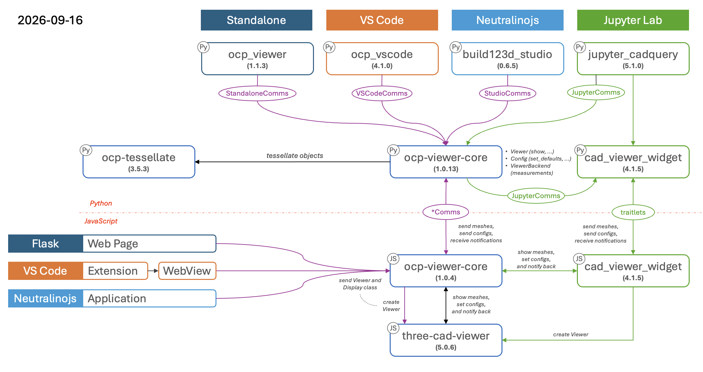

# ocp-viewer-core

The shared half of the OCP viewer ecosystem: one show suite, one tessellation, one set of config semantics, used by four viewers that each keep their own transport and their own settings storage.

Currently supported hosts (viewers):

- [ocp_vscode](https://github.com/bernhard-42/vscode-ocp-cad-viewer) — the VS Code extension
- [ocp_viewer](https://github.com/bernhard-42/ocp-viewer) — the standalone viewer, `python -m ocp_viewer`
- [Jupyter CadQuery](https://github.com/bernhard-42/jupyter-cadquery) — The viewer for Jupyter Lab through [cad-viewer-widget](https://github.com/bernhard-42/cad-viewer-widget)
- [build123d Studio](https://github.com/bernhard-42/build123d-studio) — The standalone app based on [neutralinojs](https://neutralino.js.org/)



The user-facing documentation of the shared behavior — the show commands, the config system, the viewer window and its tools — lives in [docs/](./docs/index.md). Each host documents only its own specifics and refers there for the rest.

Published as one project to two registries: `ocp-viewer-core` on PyPI for the Python half, `ocp-viewer-core` on npm for the JavaScript half. Their major.minor is the contract and must match; the patch level is each half's own, so a one-sided fix ships without an artificial release of the other half. See [Development.md](./Development.md).

## The idea

Each host provides a `Comms` — a Python encoder and a JavaScript decoder, shipped as a pair — and a settings source. Everything above that is shared and knows nothing about which host it is running in.

Per-host imports stay per host:

- `from ocp_vscode       import *` or `from ocp_vscode       import show, set_defaults, ...`
- `from build123d_studio import *` or `from build123d_studio import show, set_defaults, ...`
- `from jupyter_cadquery import *` or `from jupyter_cadquery import show, set_defaults, ...`
- `from ocp_viewer       import *` or `from ocp_viewer       import show, set_defaults, ...`

## Layout

| path                        | what                                                                                                |
| --------------------------- | --------------------------------------------------------------------------------------------------- |
| `ocp_viewer_core/`          | the Python half                                                                                     |
| `ocp_viewer_core/config.py` | the config keys, each mapped to the name three-cad-viewer knows it by, and the precedence over them |
| `ocp_viewer_core/comms.py`  | the transport a host implements, and the session that caches what it answers                        |
| `ocp_viewer_core/logo.py`   | the splash logo as measurable geometry, for a host's measurement backend                            |
| `js/src/logo.js`            | the splash logo as tessellated data plus its config, for the renderer                               |
| `js/`                       | the JavaScript half, published to npm                                                               |
| `tests/`                    | including the conformance kit                                                                       |

`ocp_viewer_core/__init__.py` is import-free by design: hosts import the submodule they need, so that importing the package never pulls in the tessellator or OCP.

## Use

A host writes one class and supplies one list. `exclude_keys` names the keywords it may not be told, because its surface decides them - the show signature is the superset of every host's, so a keyword one host owns is a keyword another has to refuse by name rather than ignore.

```python
comms = MyComms()
session = Session(comms)                        # sets session cache to None
config = Config(session, ("cad_width", "height"))
show(objects)
```

What a host _persists_ between sessions is its own business and needs no key list here: it answers with values, from `Comms.workspace_config()`. Which of the viewer's reported state counts as configuration - and so survives into the next show - is `keys.CONFIG`, derived from the vocabulary, because that set is a property of three-cad-viewer's state and not of any host's settings.

## Dependencies

- The Python package [ocp-tessellate](https://github.com/bernhard-42/ocp-tessellate) for tessellation of [OCP based CAD objects](https://github.com/cadquery/OCP)
- The Javascript package [three-cad-viewer](https://github.com/bernhard-42/three-cad-viewer), the actual viewer component.

No OCP provider is declared — the same `OCP` namespace is supplied by `cadquery_ocp`, `cadquery_ocp_novtk` and conda's `OCP`, and naming one would break users of the other two. The host or the user chooses.

## Licence

Apache-2.0.
